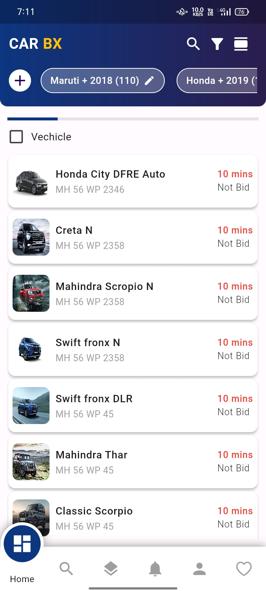
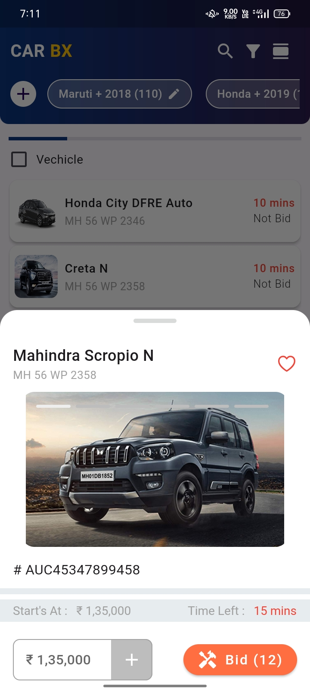
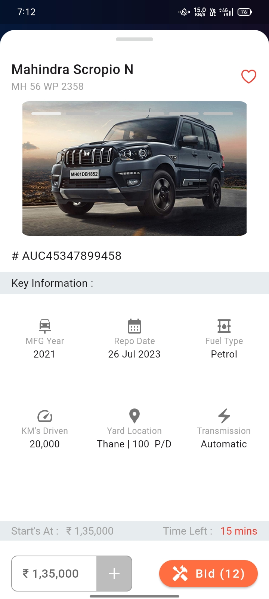
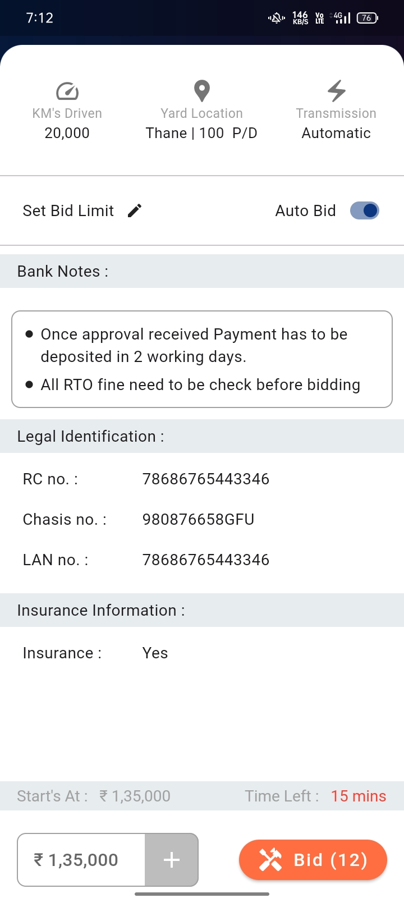

<!-- # Cardesignapp

It flutter based.

## Getting Started

This project is a starting point for a Flutter application.

A few resources to get you started if this is your first Flutter project:

- [Lab: Write your first Flutter app](https://docs.flutter.dev/get-started/codelab)
- [Cookbook: Useful Flutter samples](https://docs.flutter.dev/cookbook)

For help getting started with Flutter development, view the
[online documentation](https://docs.flutter.dev/), which offers tutorials,
samples, guidance on mobile development, and a full API reference. -->

# Car Detail Frontend App

Welcome to the Car Detail Android App repository! This repository contains the source code for an Android application designed to provide users with comprehensive details about various cars.

## Screenshots :

<!--  -->

    
    
    
    

## Installation

To clone this repository and run the Car Detail Android App on your local machine, follow these steps:

1. Clone the repository using the following command:
 
git clone https://github.com/mohitpraja/CarDesignApp.git

